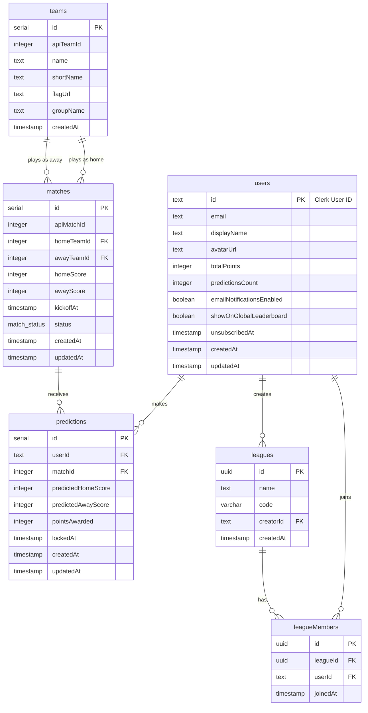

# World Cup Predictor

A high-performance, real-time football prediction platform built for global tournaments, designed to deliver type-safe, low-latency prediction workflows and private competitive leagues.

[](https://nextjs.org/)
[](https://www.typescriptlang.org/)
[](https://orm.drizzle.team/)
[](https://neon.tech/)
[](https://clerk.com/)
[](https://elysiajs.com/)
[](https://opensource.org/licenses/MIT)

---

### 🔗 Demo
*   **Live Demo**: [world-cup-predictor-taupe.vercel.app](https://world-cup-predictor-taupe.vercel.app)
*   **Source Code**: [github.com/DevYoma/world-cup-predictor](https://github.com/DevYoma/world-cup-predictor)

---

## 📖 Overview

### The Problem
I wanted to build something my friends and I could play and compete on that would be related to the World Cup. I wanted to build something that would bring football lovers together.

### The Solution
**WorldcupPredictor** is a full-stack application built with Elysia mounted in Next.js, with a PostgreSQL instance on Neon, Clerk for authentication, and Drizzle ORM.

---

## ⚡ Features

*   **🔒 Secure Authentication & Sync**: Managed by Clerk (OAuth & Email/Password), integrated into our Postgres database via dynamic server-side profiles and webhook sync.
*   **⚽ Lock-on-Kickoff Predictions**: Flexible inline forms allowing authenticated and anonymous users (limited to next 3 matches) to predict scores, with automatic validation locking exactly at kickoff.
*   **🏆 Dual Leaderboard System**: Comprises a global rankings leaderboard and customizable private leagues with unique invite codes (e.g. `WC-A7B8`) to compete directly with friends.
*   **🔄 External API Feeds Integration**: Sync job scripts that periodically poll external data providers (Football-Data.org) to update fixture statuses, scores, and qualified teams.
*   **📬 Dynamic Reminders**: Background jobs that fetch pending predictions for matches starting in the next 24 hours and send reminders via Brevo using template-driven `React Email` markup.
*   **⚡ Type-Safe REST Layer**: Elysia.js router embedded directly into Next.js App Router API directory, providing validation constraints and shared TypeScript types.
*   **📱 Rich Dark-Mode UI**: Built with Tailwind CSS and Shadcn/UI for a premium, clean, dark-mode design fully optimized for mobile devices.

---

## 🛠️ Tech Stack Table

| Layer | Technology | Rationale |
| :--- | :--- | :--- |
| **Frontend** | Next.js (v15 App Router) | Selected for its routing flexibility, hybrid server/client execution model, and image optimization assets. |
| **Backend** | Elysia.js | Handles backend routing. Runs as a high-performance, single-instance router mounted to Next.js API catch-all handlers. |
| **Database** | Neon Serverless PostgreSQL | Serverless Postgres database allowing automatic scale-to-zero compute and database pooling over HTTP. |
| **Authentication** | Clerk Auth | Provides reliable user session management, Google OAuth flow, and webhook-driven profile sync. |
| **ORM** | Drizzle ORM | TypeScript-first ORM providing SQL-like queries, migrations generation, and strong type safety. |
| **Styling** | Tailwind CSS (v4) | Fast, utility-first CSS styling that avoids bloating bundle size while providing cohesive color spacing. |
| **Email Service** | Brevo & React Email | Dynamic HTML email template compilation inside React, sent using Brevo's REST SMTP API. |
| **State & Fetching** | TanStack React Query | Manages query caching, mutation states, browser invalidation triggers, and offline prediction sync. |

---

## 📐 Project Flow

The application flow is straightforward:
1. We get the match data from an external API and store them in the database.
2. The user signs up, retrieves the match data from the database, and submits predictions.
3. They see their score after matches finish and move up the rankings/leaderboard.

--- 

## 🗄️ Database Design

Designing the data model was the most important part of building this application.

### Entity Relationship Diagram


### Design Notes:
*   **Nullable Knockouts**: `homeTeamId` and `awayTeamId` in the `matches` table are nullable. This is essential for knockout rounds (e.g. Round of 32) where team slots are created before the playing teams are decided.
*   **Index Optimizations**: Indexes are placed on `matches.kickoff_at` and `matches.status` to ensure fast query sorting. A composite unique index on `predictions(user_id, match_id)` prevents users from inserting duplicate predictions for a single match.

---

## 🔒 Authentication & Authorization

All secure endpoints undergo authorization checks.
1.  **Session Verification**: The `lib/auth/index.ts` helper reads the active Clerk JWT from the incoming request context.
2.  **Elysia Middleware Authorization**: Endpoints like `/api/predictions` and `/api/leagues` run an authorization check. If the Clerk session is invalid or missing, the route returns a `401 Unauthorized` response immediately.
3.  **Cron/Sync Authentication**: Public sync routes like `/api/sync/matches` require a secret request header (`x-sync-secret`) matching `process.env.SYNC_SECRET` to prevent unauthorized execution.

---

## 📂 Folder Structure

```tree
├── app/                  # Next.js App Router (pages and api wrappers)
│   ├── api/              # API Route directory (Elysia mounted here)
│   ├── dashboard/        # Dashboard layout and page
│   ├── leaderboard/      # Global leaderboard UI page
│   ├── leagues/          # Private competitive leagues UI pages
│   ├── matches/          # Fixtures list and inline prediction fields
│   ├── settings/         # User profile privacy and email notification toggles
│   ├── providers.tsx     # TanStack Query & React Context providers
│   └── globals.css       # Custom styling configurations
├── components/           # Reusable UI component blocks (Header, MatchList, etc.)
├── drizzle/              # Drizzle ORM migrations and snapshot logs
├── lib/                  # Backend modules, schemas, database helpers
│   ├── api/              # Elysia plugins (leagues, stats)
│   ├── auth/             # Clerk auth helpers and sync checks
│   ├── db/               # Drizzle schemas, index, and match sync scripts
│   └── email.tsx         # Brevo SMTP handler & React Email layouts
├── public/               # Static assets (images, logos)
└── scratch/              # Temporary test scripts
```

---

## 📖 Lessons Learned

Building this application demonstrated the importance of:
*   **Type Safety Cohesion**: Sharing type interfaces between Elysia, Drizzle database entities, and the React frontend eliminates entire categories of runtime serialization bugs.
*   **Stateless Scaling**: Embedding backend routers like Elysia inside serverless edge routes allows the application to handle high request concurrency around match kickoff events without requiring dedicated server maintenance.

---

## 🚀 Future Roadmap

This project is evolving into a complete football prediction platform focused on the **English Premier League (EPL)**, including:
*   Support for English Premier League fixtures.
*   Live fixtures and real-time standings.
*   Weekly match predictions and analytics.
*   Detailed team pages, player statistics, and match statistics.
*   **Real-time Score Synchronization**: Implementing WebSockets to push immediate scoreboard updates upon match completion, bypassing latency limitations of the freemium API tier.

---

## 📄 License
Distributed under the MIT License. See [LICENSE](LICENSE) for more details.

---

## 💖 Acknowledgements
*   [Football-Data.org API](https://www.football-data.org/) for the tournament data feed.
*   [Next.js documentation](https://nextjs.org/docs) for the routing model.
*   [Shadcn/UI](https://ui.shadcn.com/) for the premium styling assets.
